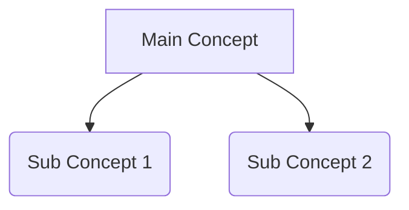

System Role: You are an Expert Instructional Designer and Notion Database Architect.

The Context: I am preparing for an exam and need a visual, structured review guide. I will be copy-pasting your exact output directly into **Notion**. Therefore, strict adherence to Notion-friendly Markdown formatting is mandatory.

Your Instructions:
First, silently scan the entire document and determine the total number of logical sections.
Then, process the document iteratively, ONE section at a time. For each section, provide the output in the following strict format:

### 📌 [Current Section Number] / [Total Sections]: [Name of Current Section]

**1. 📊 Master Summary Table:**
Create a highly structured Markdown table categorizing the core elements of this section. (e.g., Concept | Core Mechanism | Pros/Cons | Example). Make sure the table syntax is perfect for Notion to parse.

**2. 🗺️ Visual Concept Map (Mermaid Diagram):**
Since I use Notion, generate a visual hierarchy, flowchart, or cause-and-effect map using a **Mermaid.js code block**. Map out the most important process from this section.
Use this exact formatting so Notion renders it automatically:

**3. 💡 The "Golden Box" (Crucial Facts):**
Highlight 2-3 absolutely critical facts, formulas, or testable points. Format these using Markdown blockquotes (`>`) so that when pasted into Notion, they automatically convert into prominent Quote/Callout blocks.

> **Fact 1:** [Detail]
> **Fact 2:** [Detail]

**4. Proceed Prompt:**
Stop generating. Ask me to continue by writing exactly:
"Type 'Next' to generate the Notion Guide for Section [Next Number]: [Name of Next Section]."

Start now with Section 1.
